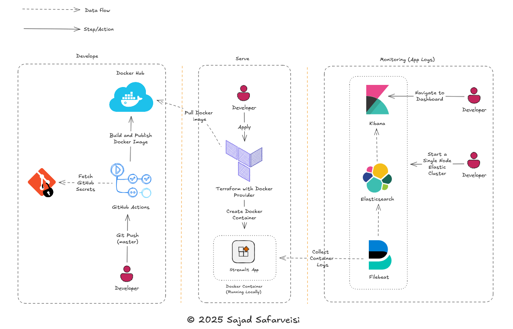

# 🚀 Unsupervised Novelty Detection Using the Local Outlier Factor (LOF)

Novelty detection is a critical technique used in scenarios where a set of "normal" data is available and the aim is to identify "new" or "novel" data points that deviate from this established norm. Unlike outlier detection, which assumes the dataset may be mostly clean while containing a few outliers, novelty detection presumes the reference data for training is devoid of any anomalies. This approach is highly beneficial in environments where the concept of "novel" is relative to a predefined baseline of normalcy, and is applicable as incoming data is continuously assessed.

## Usage

The app is deployed as a [Streamlit](https://streamlit.io/) dashboard and is accessible on port `8502` of your localhost. Users can select a station UUID from the `selectbox` to view water level measurements over the last hour (the prediction window) and detect any novelties. The unsupervised machine learning model is trained on a six-hour reference period, allowing it to identify novelties within the prediction window effectively.

## About the API

[PEGELONLINE](https://www.pegelonline.wsv.de/webservice/ueberblick) provides web services that publish real-time raw data of various hydrological parameters, such as water levels, from federal waterways for up to 30 days retrospectively. 

> [!IMPORTANT] 
> These web services are free to use, although the data is provided "as is" without verification from the managing waterway and shipping offices.

## 🏃‍♀️‍➡️ Getting started (local deployment)

```bash
# Run a container in detached mode
./run-docker-app.sh <tag of the docker image>
```

You can also start the container via [Terraform](https://www.terraform.io/):

```bash
cd terraform/docker
terraform init # Only once
terraform plan # To see the changes to be applied (every time a new tf file is added or modified)
terraform apply -var="docker_repo=novelty" -var="image_tag=24.12.30" # Creating the docker container
# If -var is not supplied, the default values are used (see variables.tf in the directory)
```

> [!Note]
> This example shows how Terraform can be used to start a Docker container, demonstrating a different approach. However, Terraform is primarily intended for provisioning, creating, and managing infrastructure, such as setting up a Kubernetes cluster on IONOS Cloud. I personally do not recommended it for deploying applications.

The streamlit dashboard should be now available at http://localhost:8502. 

To destroy the docker container, run:

```bash
terraform destroy
``` 

## Monitoring the app logs (local deployment)

We use `Filebeat --> Elasticsearch --> Kibana` stack to monitor the logs of the docker container spawned above (logs are located at `/var/lib/docker/containers` of the host machine). All three services will run in their own docker containers. First, change the working directory to `/elastic-start-local`.

🐳 Run the following command to start a single-node Elastic cluster: 

```bash
./start.sh
```
> [!NOTE]
> On linux machine, make sure the value of `vm.max_map_count` in `/etc/sysctl.conf` is at least `262144`. For Mac and windows users
> please see section [Using the Docker images in production](https://www.elastic.co/guide/en/elasticsearch/reference/current/docker.html#docker-prod-prerequisites).

🛑 To stop the cluster:

```bash
./stop.sh
```

🗑️ To remove volumes and containers (Filebeat, Elasticsearch, and Kibana):

```bash
./uninstall.sh
```

### 🌐 Endpoints

After running `start.sh`:
- Elasticsearch will be running at http://localhost:9200
- Kibana will be running at http://localhost:5601

## CI/CD (remote deployment)

We utilize GitHub Actions, triggered by each push to the `master` branch, to build a new Docker image, push it to Docker Hub, and deploy it to a Kubernetes cluster hosted on IONOS Cloud (see `.github/workflows/build-and-deploy.yml` for details). To enable this workflow, a Kubernetes cluster must be available (provisioned using Terraform - please see `terraform/ionos-cloud`), with its `KUBECONFIG` set as a secret in the repository. Additionally, the `DOCKER_HUB_TOKEN` needs to be stored as a secret to execute the docker login step in the workflow (named as `Push the docker image to Docker Hub`). We use [k9s](https://k9scli.io/)
to check the status/sucess of the deployment on the K8s cluster (please see an image of a successful deployment below).

```bash
k9s --kubeconfig absolute/path/to/kubeconfig.yml # You get one after creating a K8s cluster (please see helper/get_k8s_config.py)
```
")


## Diagram 



Please be aware that the diagram above illustrates only the local deployment (represented in the `serve` area).


## Table of files and directories

Some files or folders have been omitted from the description because they are not important.

|           File/Directory        |             Description           |
|:-------------------------------:|:---------------------------------:|
| `water_level_anomaly_detection/` | Contains all source code for the application. |
| `.python-version` | Specifies the Python version used in app development. |
| `build-image.sh` | Script to build the Docker image; logs are directed to `build_image.log`. |
| `Dockerfile` | Provides instructions to build the Docker image. |
| `run-docker-app.sh` | Script to launch the Docker container and instantiate the app. |
| `setup-env.sh` | Script to set up the virtual environment and install development dependencies in the dev mode. | 
| `elastic-start-local/` | Contains all scripts as well as configurations to setup a single-node Elastic cluster |
| `.github/workflows` | YAML file for the Github actions (CI/CD) |
| `terraform/` | Terraform configuration files for each provider |
| `playbook.yml` | Ansible playbook (automation of cloning the git repo on selected machines (with ssh access)) |
| `inventory.yml` | Ansible inventory (remote managed nodes) |
| `helper/` | Contains all helper modules |
| `deploy/` | Contains manifest files to deploy the app on K8s |


## Extra

### Ansible

We use Ansible to automate the process of cloning a Git repository on target servers to which we have SSH access. This approach allows us to replicate the repository on multiple servers without the need for manual work. Refer to `playbook.yml` for the tasks involved and `inventory.yml` for the list of target servers.  